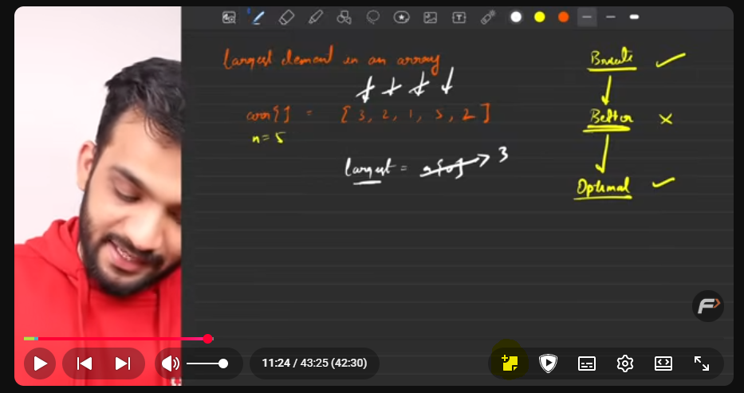
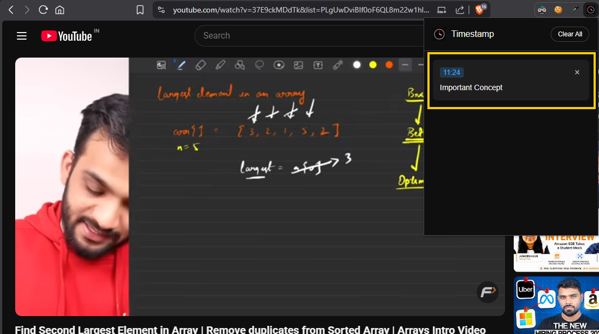

# YT Timestamp

A small browser extension for YouTube that lets you save timestamped notes for the current video.

## Features

- Adds a `+` note button to the YouTube player controls
- Saves notes with the current video timestamp
- Opens notes in the extension popup for the active YouTube video
- Click a timestamp in the popup to jump to that point in the video
- Clear all notes for the current video from the popup

## Screenshots

## How it works

- `content.js` injects a note button into the YouTube watch page controls
- When you add a note, the current video time and note text are saved to `chrome.storage.local`
- `popup.js` reads the saved notes for the current video and displays them
- Clicking a note timestamp sends a message to `content.js` to seek the video

## Shortcut

- Press `Ctrl + Q` to open the add-note modal from the YouTube watch page

## Installation

Use the instructions in `INSTALL.md` to load the extension locally in Chrome-based browsers.
